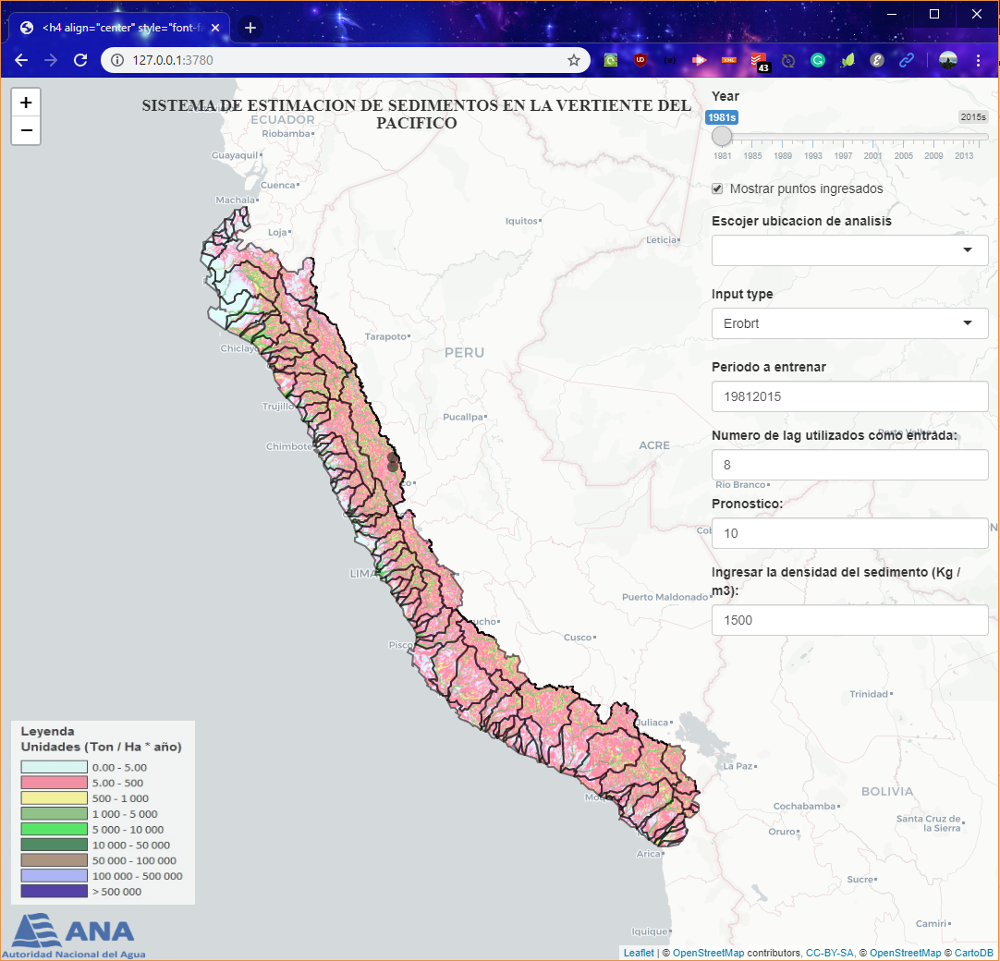

El presente producto servirá de insumo para la planificación de los recursos hídricos y será una herramienta en el marco del programa de presas. Los temas revisados son los siguientes:

- Modelo de la erosión de suelos mediantes la Ecuación Universal de Pérdida de suelos Revisado (RUSLE) y Sistema de Información Geográfica (SIG)
- Estimación de la producción de sedimentos en embalses con el Ratio de Aporte de Sedimentos (SDR)
- Estimar el volumen de sedimentos acumulados en las propuestas de embalses a partir de una relación con los sedimentos y d) la elaboración de un aplicativo con interfaz gráfica en el lenguaje de programación R para evaluar la carga de sedimentos y para los fines que solicita la Autoridad Nacional del Agua.

