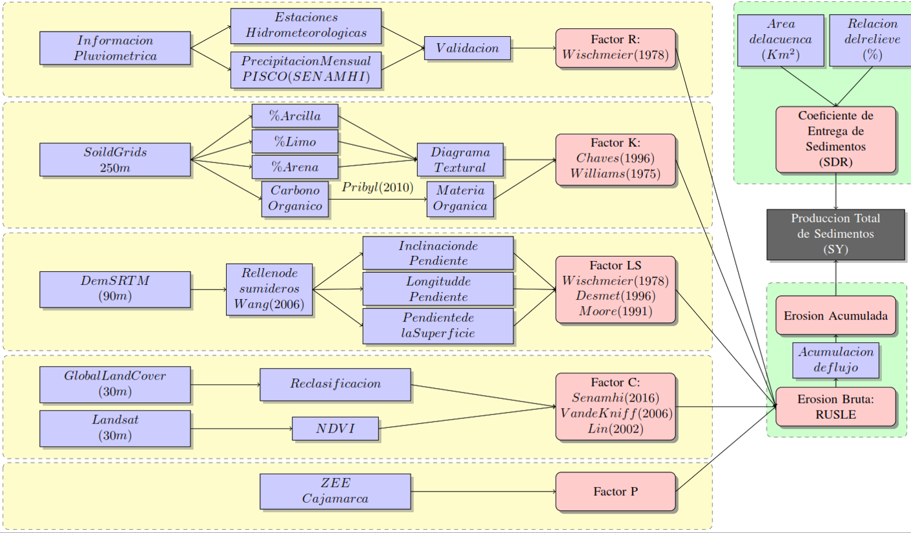

# Modelo de erosión Rusle y coeficiente de aporte de sedimentos (SDR) para la estimación del volumen muerto de reservorios

[Acceso al documento]("https://hdl.handle.net/20.500.12672/10078")

Ante una creciente población, el recurso hídrico lleva a la necesidad de crear almacenes que sean de utilidad para los meses donde escasee este recurso. Los avances en ingeniería han permitido la creación de presas de gran magnitud. Sin embargo, un tema poco visto en el diseño de presas es la estimación de su tiempo de vida por acumulación de sedimentos. En esta investigación se utiliza un modelo empírico con herramientas satelitales de acceso libre que permitan estimar el volumen muerto a través de los años y estimar su tiempo de vida útil. El modelo de erosión RUSLE y el coeficiente de producción de sedimentos (SDR) ya han sido utilizados con resultados satisfactorios en cuencas de distintas partes del mundo, en esta investigación se ha validado a partir del volumen de sedimentos del reservorio Gallito Ciego.



